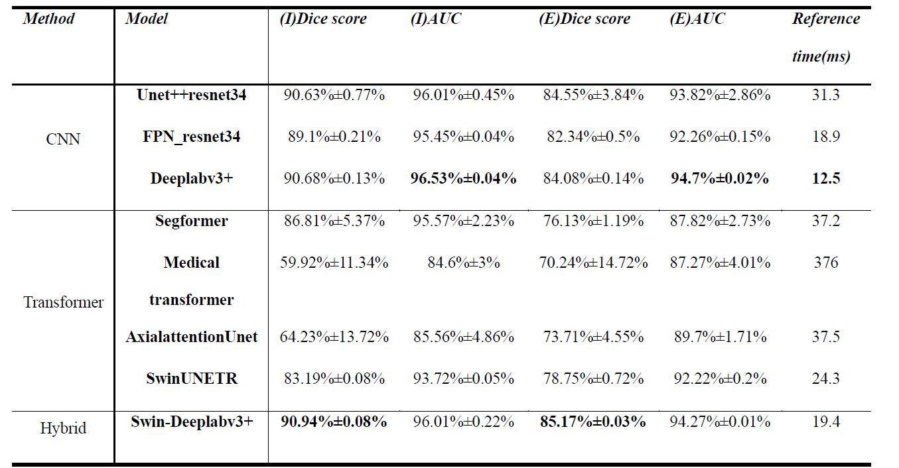
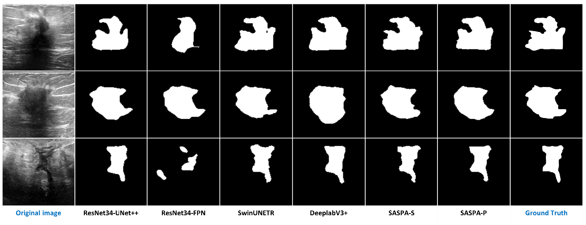
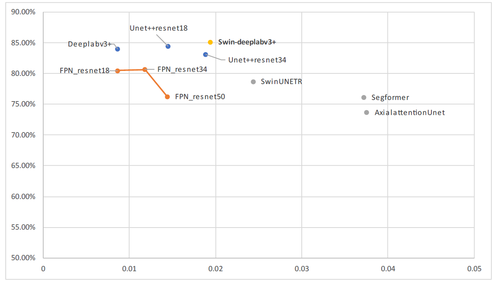

# Swin-DeeplabV3+: Enhanced Segmentation Performance of Breast Tumor Ultrasound Images Using SwinBlock

Swin-DeeplabV3+是由DeeplabV3+為原型修改後加入Swin-Transformer模組的模型，結合原有CNN框架與作為特徵增強的Swin-attention，應用於超音波乳房腫瘤影像分割取得有效的結果。
本模型架構使用Encoder-Decoder的建構方法。Encoder部分以ImageNet預訓練的權重之ResNet34網路作為特徵提取，；Decoder部分因原本DeeplabV3+的單一特徵使用多個stride擴張卷積不利於超音波影像，
因此我們改良原本DeeplabV3+的ASPP模組，使用多種Encoder輸出特徵分別由ASPP的各種步距分別卷積，並在ASPP模組前方加入SwinBlock作為特徵增強使用。
結果顯示我們的模型超越了原本的DeeplabV3+、CNN-based的ResNet-UNet以及Transforme-based的MedT等等。

# Introduction
### Swin-DeeplabV3+ structure


# Getting start
config/train_config: 訓練參數設定
```yaml
data:
　ds_path: Dataset path
　...
optimization:
  epochs: epochs
  batchsize: batchsize
  ...
save:
  direc: Result saving path
  ...
```
val_config.ini: 驗證/測試參數設定
```ini
[model_set]
MOTHER_FOLDER = Result saving path
Internal_validation_path = Internal validation dataset path
External_validation_path = External validation dataset path
```
Dataset architecture
```commandline
Train dataset:
    benign_new
        images
            image1
            image2
            ...
        masks
            mask1
            mask2
            ...
    malignant_new
        images
            image1
            image2
            ...
        masks
            mask1
            mask2
            ...
```
```
Test dataset(Including internal validation dataset):
    images
        image1
        image2
        ...
    masks
        mask1
        mask2
        ...
```

# Benchmark
本測試以mIoU、Dice score作為模型效能評斷標準。另外也會用AUC還有Inference time來評斷模型預測結果的信心程度以及模型的推論時間。




# Training Setting & Dataset
## Setting
| images size | Epochs | Loss function            | batchsize | learning rate | weight decay | Accumulation |
| ----------- | ------ | ------------------------ | --------- | ------------- | ------------ | ------------ |
| 128 x 128   | 200    | `BCEDicePenalizeBorderLoss` | 8   | 0.001         | 1e-5         | 4            |
## Dataset

| Name | Num of images | Image size           | Format |
| ----------- | ------ | ------------------------ | --------- | 
| Baheya Foundation For Early Detection & Treatment Of Breast Cancer   | 647    | 500*500 | PNG   |
| STU-Hospital   |  40   | 128*128 | PNG   |

另外為了測試模型對於資料集的學習能力，採用k-fold=5的方式進行訓練。我們將採用兩種資料集分別用於訓練與測試使用:

* Training dataset: 647 breast cancer images
* Testing dataset: 42 breast cancer images

測試模型性能分別以1/5的Training dataset與Testing dataset測試Internal validation與External validation。


# Result
## Segmentation performance in different model


## Inference time benchmark

