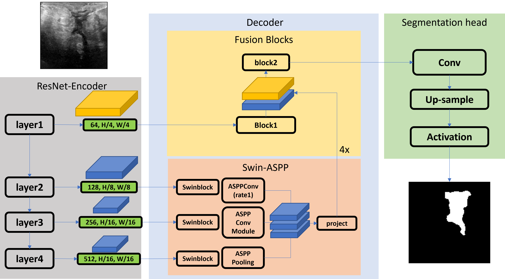
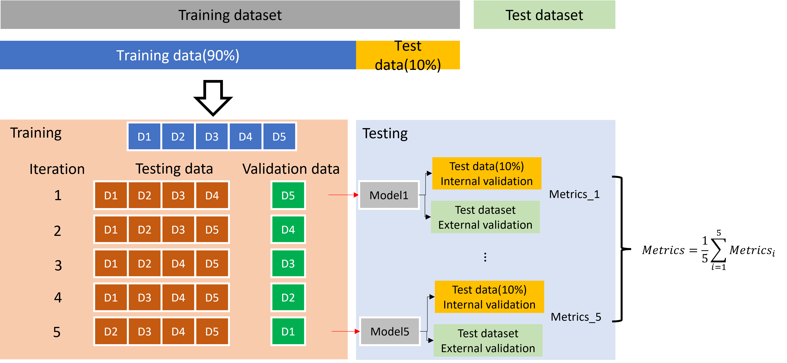
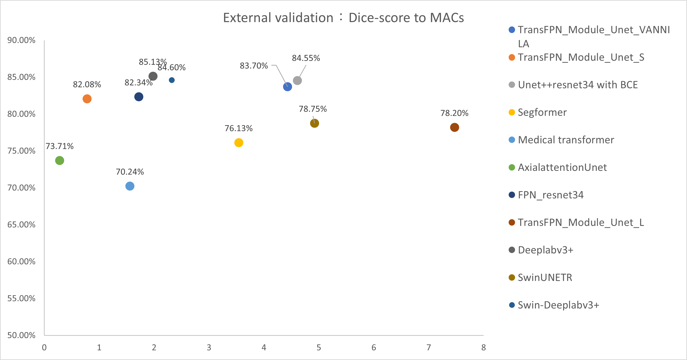

# SASPA：The combination of Swinblock and Atrous convolutional pyramid enhances the segmentation performance of breast tumor ultrasound images

本研究提出名為SASPA(Swin Atrous Spatial Pyramid Assembly)模型，以DeeplabV3+之ASPP模組為基礎設計，特別針對超音波乳房腫瘤影像分割任務設計模型架構，改善特徵結合方式並加入Swinblock增加模型分割表現，並提出兩個版本的SASPA架構：SASPA-S與SASPA-P。此研究使用乳房腫瘤分割為主要任務，訓練資料集與測試資料分別使用不同來源的資料，並透過K-Fold、資料集分割，將測試分為內部資料測試與外部資料測試，測試模型對相同來源資料集與不同來源資料之泛化能力。

# Introduction
### SASPA structure


# Getting start
config/train_config: 訓練參數設定
```yaml
data:
　ds_path: Dataset path
　...
optimization:
  epochs: epochs
  batchsize: batchsize
  ...
save:
  direc: Result saving path
  ...
```
val_config.ini: 驗證/測試參數設定
```ini
[model_set]
MOTHER_FOLDER = Result saving path
Internal_validation_path = Internal validation dataset path
External_validation_path = External validation dataset path
```
Dataset architecture
```commandline
Train dataset:
    benign_new
        images
            image1
            image2
            ...
        masks
            mask1
            mask2
            ...
    malignant_new
        images
            image1
            image2
            ...
        masks
            mask1
            mask2
            ...
```
```
Test dataset(Including internal validation dataset):
    images
        image1
        image2
        ...
    masks
        mask1
        mask2
        ...
```

# Benchmark
本測試以mIoU、Dice score作為模型效能評斷標準。另外也會用AUC還有Inference time來評斷模型預測結果的信心程度以及模型的推論時間。


# Training Setting & Dataset
## Setting
| images size | Epochs | Loss function            | batchsize | learning rate | weight decay | Accumulation |
| ----------- | ------ | ------------------------ | --------- | ------------- | ------------ | ------------ |
| 128 x 128   | 200    | `BCEDicePenalizeBorderLoss` | 8   | 0.001         | 1e-5         | 4            |
## Dataset

| Name | Num of images | Image size           | Format |
| ----------- | ------ | ------------------------ | --------- |
| Baheya Foundation For Early Detection & Treatment Of Breast Cancer   | 647    | 500*500 | PNG   |
| STU-Hospital   |  40   | 128*128 | PNG   |

另外為了測試模型對於資料集的學習能力，採用k-fold=5的方式進行訓練。我們將採用兩種資料集分別用於訓練與測試使用:

* Training dataset: 647 breast cancer images
* Testing dataset: 42 breast cancer images

測試模型性能分別以1/5的Training dataset與Testing dataset測試Internal validation與External validation。



# Result
## Segmentation performance in different model


## Inference Time to Dice score benchmark

